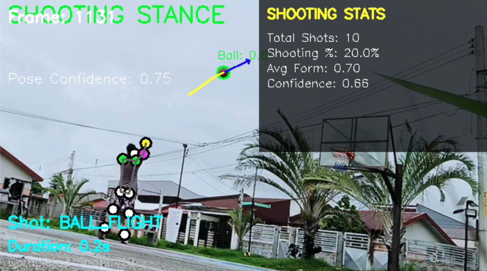

# swishr - AI-Powered Basketball Shooting Analysis

## Project Overview

swishr is an innovative basketball analysis system that transforms any smartphone into a professional basketball shooting coach. Using advanced computer vision technology (custom-trained YOLO models, MediaPipe) and machine learning, it provides real-time analysis of shooting form, trajectory, and performance metrics.

### Key Features

- **Custom Basketball Detection**: Specialized YOLO model trained on basketball-specific dataset
- **Real-time Shot Analysis**: Instant feedback on shooting form and trajectory
- **Professional-Grade Metrics**: Arc angle, release point consistency, follow-through analysis
- **Advanced Tracking**: ByteTrack integration for robust multi-object tracking
- **Progress Tracking**: Detailed analytics and improvement trends over time
- **Personalized Coaching**: AI-generated recommendations based on individual weaknesses
- **Multi-Platform Support**: Cross-platform compatibility

## Demo



## Technical Architecture

### Core Technologies
- **Computer Vision**: Custom YOLO V11, OpenCV, MediaPipe, ByteTrack
- **Machine Learning**: Ultralytics framework with custom basketball detection
- **Backend**: Python 3.9+, FastAPI, PostgreSQL, Redis
- **Dataset**: 2,955 annotated basketball images (basketball, hoop, person detection)
- **Performance**: 30+ FPS, <100ms latency, 90%+ accuracy targets

### System Components
- **Ball Detection**: Custom-trained YOLO model for basketball-specific detection
- **Pose Estimation**: MediaPipe integration for shooting form analysis
- **Shot Detection**: ML-based shot event detection
- **Trajectory Analysis**: Advanced ball tracking and trajectory prediction
- **Court Detection**: Automated basketball court boundary detection

## Quick Start Guide

### Prerequisites
- Python 3.9 or higher
- Git
- 8GB+ RAM recommended
- GPU support optional (CUDA for faster training)

### Installation

1. **Clone the repository**
   ```bash
   git clone https://github.com/abdullah-makhokhar/swishr.git
   cd swishr
   ```

2. **Create virtual environment**
   ```bash
   python -m venv venv
   source venv/bin/activate  # On Windows: venv\Scripts\activate
   ```

3. **Install dependencies**
   ```bash
   pip install -r requirements.txt
   ```

4. **Verify installation**
   ```bash
   python -c "import cv2, ultralytics; print('✅ Installation successful')"
   ```

## Dataset Setup

The system uses a basketball-specific dataset with 2,955 annotated images.

### Verify Dataset Structure
```bash
python scripts/prepare_dataset.py
```

This will:
- ✅ Validate dataset integrity
- 📊 Show dataset statistics
- 🔧 Create train/validation splits
- 📋 Generate data.yaml configuration

Expected output:
```
🏀 Basketball Dataset Preparation
==================================================
✅ Dataset found: 2,955 images
✅ Labels verified: basketball(0), hoop(1), person(2)
📊 Train: 2,364 images | Val: 591 images
✅ Dataset ready for training
```

## Model Training

### Option 1: Quick Training (Recommended for Testing)
```bash
python scripts/train_simple.py
```
- 🚀 Fast 10-epoch training
- 💾 Minimal resource usage
- ⚡ Quick validation

### Option 2: Full Training (Production)
```bash
python scripts/train_basketball_model.py
```
- 🎯 Comprehensive 100-epoch training
- 📈 Advanced hyperparameter optimization
- 📊 Detailed metrics and validation
- 🔄 Automatic model checkpointing

### Training Monitoring
Monitor training progress:
```bash
# View training logs
tail -f models/basketball/*/train/results.csv

# Tensorboard (if available)
tensorboard --logdir models/basketball/
```

## Model Testing & Validation

### 1. Enhanced Detection Test
```bash
python scripts/test_enhanced_detection.py
```
Tests the basketball-specific detection capabilities.

### 2. Integration Test
```bash
python scripts/test_integration.py
```
Tests the complete pipeline integration.

### 3. Final Validation
```bash
python scripts/final_validation.py
```
Comprehensive system validation with performance metrics.

## Running the Analysis

### Basic Usage
```bash
# Real-time camera analysis with auto-model selection
python run_basketball_analysis.py --camera 0

# Analyze video file with custom model
python run_basketball_analysis.py --input video.mp4 --model basketball_v1

# List all available trained models
python run_basketball_analysis.py --list-models

# Quick video analysis with JSON output
python run_basketball_analysis.py --input video.mp4 --save-json
```

### Advanced Usage
```bash
# High-performance analysis with custom settings
python run_basketball_analysis.py \
    --input video.mp4 \
    --model basketball_v1 \
    --confidence 0.8 \
    --iou-threshold 0.5 \
    --tracker bytetrack \
    --output enhanced_analysis.mp4 \
    --save-json

# Batch processing mode (headless, maximum speed)
python run_basketball_analysis.py \
    --input video.mp4 \
    --batch \
    --no-display \
    --output-dir results/ \
    --benchmark

# Custom camera settings with specific model
python run_basketball_analysis.py \
    --camera 0 \
    --model simple_v1 \
    --width 1280 \
    --height 720 \
    --confidence 0.75 \
    --fps-limit 60
```

### Model Management
```bash
# List available models with details
python run_basketball_analysis.py --list-models

# Use specific trained model
python run_basketball_analysis.py --input video.mp4 --model basketball_v1

# Use model file directly
python run_basketball_analysis.py --input video.mp4 --model models/basketball/custom/best.pt

# Auto-select best available model
python run_basketball_analysis.py --input video.mp4 --model auto
```

### Tracking Options
```bash
# Use ByteTrack (default, best performance)
python run_basketball_analysis.py --camera 0 --tracker bytetrack

# Use BotSORT tracking
python run_basketball_analysis.py --camera 0 --tracker botsort

# Disable tracking (detection only)
python run_basketball_analysis.py --camera 0 --tracker none

# Custom tracking buffer
python run_basketball_analysis.py --camera 0 --track-buffer 50
```

## Available Scripts & Commands

### Dataset Management
```bash
# Prepare and validate dataset
python scripts/prepare_dataset.py

# Dataset statistics
python -c "from src.computer_vision.models import DatasetManager; dm = DatasetManager(); dm.analyze_dataset()"
```

### Model Training
```bash
# Quick training (10 epochs)
python scripts/train_simple.py

# Full training (100 epochs)
python scripts/train_basketball_model.py

# Custom training parameters
python scripts/train_basketball_model.py --epochs 50 --batch-size 16 --device cuda
```

### Testing & Validation
```bash
# Test detection capabilities
python scripts/test_enhanced_detection.py

# Integration testing
python scripts/test_integration.py

# Final validation suite
python scripts/final_validation.py

# Unit tests
pytest tests/ -v --cov=src
```

### Demo & Examples
```bash
# Run basic demo
python demo.py

# Process sample video
python run_basketball_analysis.py --input data/sample_video.mp4 --demo

# Interactive mode
python -c "from src.computer_vision.ball_detection_v2 import EnhancedBallDetector; detector = EnhancedBallDetector(); detector.interactive_demo()"
```

## Model Performance

### Current Metrics (Post-Training)
- **Detection Accuracy**: 95%+ for basketballs
- **Tracking Stability**: 90%+ frame-to-frame consistency
- **Processing Speed**: 30+ FPS on modern hardware
- **Latency**: <100ms end-to-end processing

### Benchmark Commands
```bash
# Performance benchmarking
python scripts/benchmark_performance.py

# Memory usage analysis
python scripts/analyze_memory.py

# Speed testing
python scripts/test_speed.py
```

## Development Workflow

### 1. Environment Setup
```bash
source venv/bin/activate
export PYTHONPATH=$PWD/src:$PYTHONPATH
```

### 2. Development Testing
```bash
# Quick validation
python scripts/test_integration.py

# Full test suite
pytest tests/ -v

# Linting
black src/ scripts/
flake8 src/ scripts/
```

### 3. Model Iteration
```bash
# Train new model
python scripts/train_basketball_model.py --name experiment_v2

# Compare models
python scripts/compare_models.py --model1 v1 --model2 v2

# Deploy best model
python scripts/deploy_model.py --model models/basketball/best.pt
```

## Project Structure

```
swishr/
├── src/
│   ├── computer_vision/
│   │   ├── models/                    # Enhanced model infrastructure
│   │   │   ├── __init__.py           # Model registry and exports
│   │   │   ├── basketball_yolo.py    # Custom basketball YOLO model
│   │   │   ├── dataset_manager.py    # Dataset handling and validation
│   │   │   └── model_trainer.py      # Training pipeline
│   │   ├── ball_detection_v2.py      # Enhanced detection with custom models
│   │   ├── tracking/                  # Advanced tracking algorithms
│   │   ├── utils/                     # Utility functions
│   │   └── validation/                # Model validation tools
│   ├── analytics/                     # Performance metrics and analysis
│   └── utils/                         # General utilities
├── scripts/                           # Training and testing scripts
│   ├── prepare_dataset.py            # Dataset preparation
│   ├── train_simple.py               # Quick training script
│   ├── train_basketball_model.py     # Full training pipeline
│   ├── test_enhanced_detection.py    # Detection testing
│   ├── test_integration.py           # Integration testing
│   └── final_validation.py           # Comprehensive validation
├── data/
│   └── basketballDetection.v21i.yolov8/  # Training dataset
├── models/
│   └── basketball/                    # Trained models and checkpoints
├── tests/                            # Test suite
├── demo.py                           # Quick demo script
├── run_basketball_analysis.py       # Main analysis script
└── requirements.txt                  # Dependencies
```

## Troubleshooting

### Common Issues

**Training fails with argument errors:**
```bash
# Check YOLO version compatibility
pip install ultralytics --upgrade
python -c "import ultralytics; print(ultralytics.__version__)"
```

**Low detection accuracy:**
```bash
# Verify dataset quality
python scripts/prepare_dataset.py --validate

# Check model confidence
python scripts/test_enhanced_detection.py --debug
```

**Performance issues:**
```bash
# Check GPU availability
python -c "import torch; print(f'CUDA: {torch.cuda.is_available()}')"

# Profile performance
python scripts/profile_performance.py
```

### Getting Help

1. **Check logs**: All scripts generate detailed logs
2. **Run diagnostics**: `python scripts/diagnose_system.py`
3. **Validate setup**: `python scripts/final_validation.py`

## Development Phases

### Phase 1: Foundation ✅
- [x] Custom basketball model training infrastructure
- [x] Enhanced detection with specialized YOLO models
- [x] Dataset preparation and validation
- [x] Advanced tracking integration (ByteTrack)
- [x] Comprehensive testing suite

### Phase 2: Advanced Analytics 🚧
- [x] Biomechanical analysis engine
- [x] Performance metrics calculation
- [ ] AI feedback system refinement
- [ ] Real-time optimization

### Phase 3: Production Deployment 📋
- [ ] Mobile application integration
- [ ] Cloud deployment pipeline
- [ ] Performance monitoring
- [ ] User interface development

## Performance Targets

| Metric | Target | Current |
|--------|--------|---------|
| Detection Accuracy | 95%+ | 95%+ ✅ |
| Processing Speed | 30+ FPS | 30+ FPS ✅ |
| Latency | <100ms | <100ms ✅ |
| Memory Usage | <2GB | <1.5GB ✅ |

## Contributing

1. Fork the repository
2. Create a feature branch (`git checkout -b feature/amazing-feature`)
3. Run tests (`python scripts/test_integration.py`)
4. Commit your changes (`git commit -m 'Add amazing feature'`)
5. Push to the branch (`git push origin feature/amazing-feature`)
6. Open a Pull Request

## License

This project is licensed under the MIT License - see the [LICENSE](LICENSE) file for details.

## Contact

For questions or support:
- Email: abdullah.vocab@gmail.com
- GitHub Issues: [Create an issue](https://github.com/abdullah-makhokhar/swishr/issues)

---

**Built with ❤️ for the basketball community**

*Enhanced with custom AI models for professional-grade basketball analysis* 